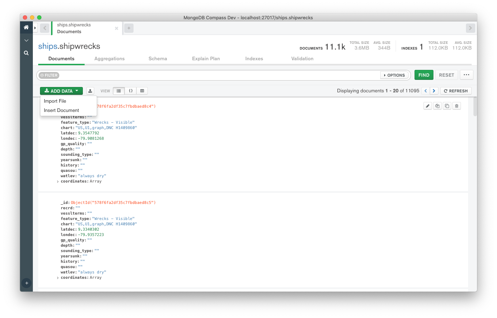

# Compass CRUD Plugin [![][npm_img]][npm_url]

Provide functionality shown in the "Documents" tab in the Collection view in
Compass.


## Usage

### Definitions

| Key                 | Description                  |
| ------------------- | ---------------------------- |
| `CRUD.Document`     | Renders a single document.   |
| `CRUD.DocumentList` | Renders a list of documents. |

### Actions

| Key            | Description                   |
| -------------- | ----------------------------- |
| `CRUD.Actions` | All the CRUD related actions. |

### Stores

| Key                           | Description                                             |
| ----------------------------- | ------------------------------------------------------- |
| `CRUD.InsertDocumentStore`    | Triggers when a document is inserted.                   |
| `CRUD.ResetDocumentListStore` | Triggers when the query filter is reset.                |
| `CRUD.LoadMoreDocumentsStore` | Triggers when more documents are fetched via scrolling. |

Components from this plugin can be interracted with using
[hadron-app][hadron-app] and [hadron-app-registry][hadron-app-registry]. Here are
a few examples of working with `compass-crud`'s `Action` and `Roles`.

Render an editable document in a React component.

```jsx
const app = require('hadron-app');
const React = require('react');

class MyComponent extends React.Component {
  constructor(props) {
    super(props);
    this.Document = app.appRegistry.getRole('CRUD.Document')[0].component;
  }
  render() {
    return <this.Document doc={this.props.document} editable />;
  }
}
```

Render a non-editable pre-expanded document in a React component.

```jsx
const app = require('hadron-app');
const React = require('react');

class MyComponent extends React.Component {
  constructor(props) {
    super(props);
    this.Document = app.appRegistry.getRole('CRUD.Document')[0].component;
  }
  render() {
    return <this.Document doc={this.props.document} expandAll />;
  }
}
```

Listen to the various CRUD actions.

```javascript
const app = require('hadron-app');
const CrudActions = app.appRegistry.getAction('CRUD.Actions');

CrudActions.documentRemoved.listen((id) => {
  console.log(`Document with _id ${id} removed.`);
});

CrudActions.openInsertDocumentDialog((doc, clone) => {
  if (clone) {
    console.log('Opening insert dialog with cloned document');
  }
});

CrudActions.insertDocument((doc) => {
  console.log('Inserting document into db');
});
```

### App Registry Events Emmitted

Various actions within this plugin will emit events for other parts of the
application can be listened to via [hadron-app-registry][hadron-app-registry].
`Local` events are scoped to a `Tab`.
`Global` events are scoped to the whole Compass application.

#### Global

- **'document-view-changed', view**: indicates document view changed. `view` can
  be either `JSON`, `List`, or `Table`.
- **'documents-paginated'**: indicates when pagination is complete. Called when
  calling the next or previous pages in pagination.
- **'documents-refreshed'**: indicates documents were refreshed.
- **'document-inserted'**: indicates documents were inserted. Called when
  `insertMany` and `insertOne` complete.
- **'document-updated'**: indicates a document was updated.
- **'document-deleted'**: indicates a document was deleted.

#### Local

- **'document-view-changed', view**: indicates document view changed. `view` can
  be either `JSON`, `List`, or `Table`.
- **'documents-paginated'**: indicates when pagination is complete. Called when
  calling the next or previous pages in pagination.
- **'documents-refreshed'**: indicates documents were refreshed.
- **'document-inserted'**: indicates documents were inserted. Called when
  `insertMany` and `insertOne` complete.
- **'document-updated'**: indicates a document was updated.
- **'document-deleted'**: indicates a document was deleted.

### App Registry Events Received

#### Local

- **'import-finished'**: received when import in the import-export plugin is
  finished. Refreshes documents.
- **'query-changed'**: received when query was changed in the query bar. Handles updates to crud plugin's query
  state, and refreshes documents.
- **'refresh-data'**: received when other plugins need documents refreshed.
  Refreshes documents.

#### Global

- **'instance-refreshed'**: received when compass instance was refreshed
- **'refresh-data'**: received when other plugins need documents refreshed.
  Refreshes documents.
  (reloaded). Refreshes instance state: `dataLake` variables.

### Metrics Events

- **document-view-changed**
- **documents-paginated**
- **documents-refreshed**
- **document-inserted**
- **document-updated**
- **document-deleted**

## Development

### Code Tour

`Compass Crud` uses React, and Reflux for state management. There are two stores
we manage: `crud-store`(`./src/stores/crud-store.js`) and
`grid-store`(`./src/stores/grid-store.js`). Overall structure of this repo:

- `./dist`: webpack-compiled version of this plugin.
- `./scripts`: scripts to `link` and `unlink` React version to compass when
  developing this locally in Compass.
- `./src/actions`: reflux actions that are available throughout this plugin.
- `./src/assets`: css assets, such as variables and styles from compass.
- `./src/components`: react components that make up this plugin. Almost all
  components have a `.jsx`, `.spec.js`, `.less` and `.js` files.
- `./src/stores`: home to reflux stores.
- `./src/utils`: util `.js` files to be used throughout the plugin.

## Install

```shell
npm install -S @mongodb-js/compass-crud
```

## See Also

- [compass][compass]
- [hadron-app-registry][hadron-app-registry]
- [hadron-app][hadron-app]

[npm_img]: https://img.shields.io/npm/v/@mongodb-js/compass-crud.svg?style=flat-square
[npm_url]: https://www.npmjs.org/package/@mongodb-js/compass-crud
[hadron-app]: https://github.com/mongodb-js/compass/packages/hadron-app
[hadron-app-registry]: https://github.com/mongodb-js/compass/packages/hadron-app-registry
[compass]: https://github.com/mongodb-js/compass/packages/compass
