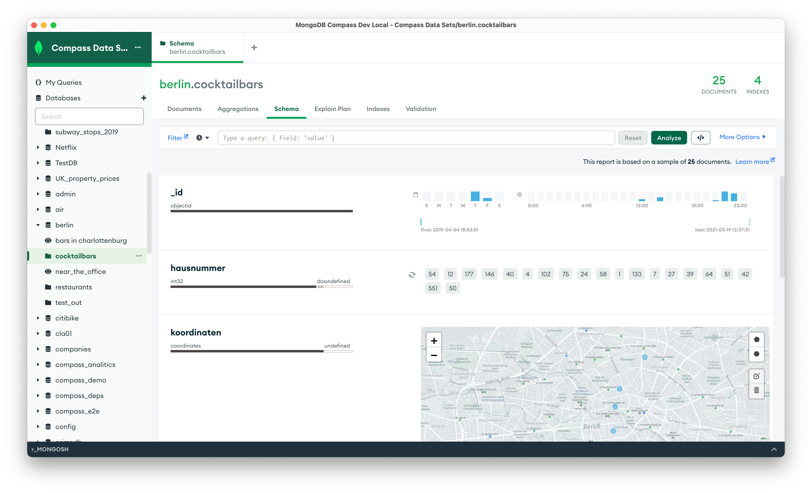

# MongoDB Compass

The MongoDB GUI.



# Development

Running Compass locally requires Node.js and npm:

- `Node.js`: ^16.15.0
- `npm`: ^8.15.1

```shell
npm install
npm start [compass|compass-readonly|compass-isolated]
```

## Plugins

**Current Plugin API Version: 3.0.0**

Majority of Compass' functionality lives in various plugins outside the main
repo. This repo just brings them all together. All external plugins are tagged
via the
[compass-plugin](https://github.com/search?q=topic%3Acompass-plugin+org%3Amongodb-js&type=Repositories)
topic in the mongodb-js organisation. There are also various [compass-tools](https://github.com/search?q=topic%3Acompass-tools+org%3Amongodb-js&type=Repositories)
and [compass-ui-tools](https://github.com/search?q=topic%3Acompass-ui-tools+org%3Amongodb-js&type=Repositories) packages that help put together the application.

Plugins can be added to Compass by requiring them as a dependency in package.json,
and by adding their installed location to the [distribution plugin list](https://github.com/mongodb-js/compass/blob/main/package.json#L42-L77) also in the
package.json. Plugin's `apiVersion` field has to match Compass'. Currently it's
at `3.0.0`.

Example of adding a dependency:

```shell
npm i -S @mongodb-js/compass-aggregations@latest
```

And in package.json:

```js
"distributions": {
  "default": "compass",
  "compass": {
    "name": "mongodb-compass",
    "plugins": [
      "node_modules/@mongodb-js/compass-aggregations", // add compass-aggregations
      // rest of the plugins required for this distribution
    ],
    "styles": [
      "index"
    ]
  },
  // other distribution config
}
```

# Contributing

For issues, please create a ticket in our [JIRA
Project](https://jira.mongodb.org/browse/COMPASS).

For contributing, please refer to
[CONTRIBUTING.md](https://github.com/mongodb-js/compass/blob/main/CONTRIBUTING.md)

Is there anything else you’d like to see in Compass? Let us know by submitting
suggestions in out [feedback
forum](https://feedback.mongodb.com/forums/924283-compass).

# License

[SSPL](https://github.com/mongodb-js/compass/blob/main/LICENSE)
