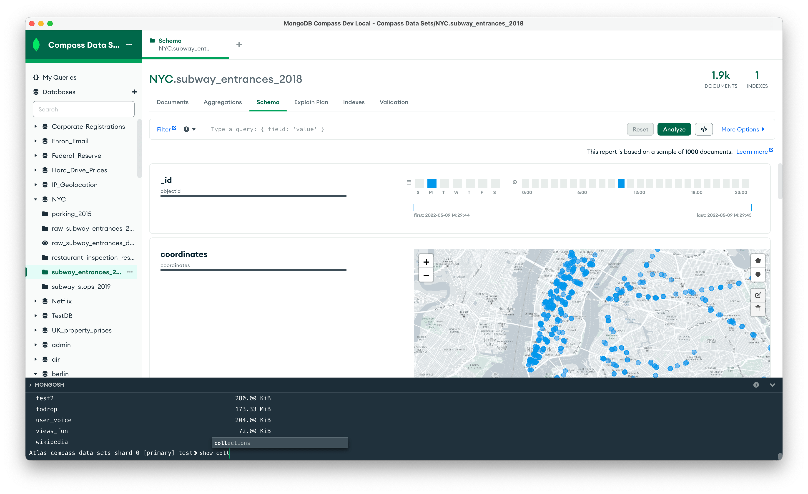

# MongoDB Compass
The MongoDB GUI.



# Development
Running Compass locally requires Node.js and npm:

- `Node.js`: ^16.15.0
- `npm`: ^8.15.1

```shell
npm install
npm start [compass|compass-readonly|compass-isolated]
```

## Plugins
**Current Plugin API Version: 3.0.0**

Majority of Compass' functionality lives in various plugins outside the main
repo. This repo just brings them all together. All external plugins are tagged
via the
[compass-plugin](https://github.com/search?q=topic%3Acompass-plugin+org%3Amongodb-js&type=Repositories)
topic in the mongodb-js organisation. There are also various [compass-tools](https://github.com/search?q=topic%3Acompass-tools+org%3Amongodb-js&type=Repositories)
and [compass-ui-tools](https://github.com/search?q=topic%3Acompass-ui-tools+org%3Amongodb-js&type=Repositories) packages that help put together the application.

Plugins can be added to Compass by requiring them as a dependency in package.json,
and by adding their installed location to the [distribution plugin list](https://github.com/mongodb-js/compass/blob/main/package.json#L42-L77) also in the
package.json. Plugin's `apiVersion` field has to match Compass'. Currently it's
at `3.0.0`.

Example of adding a dependency:

```shell
npm i -S @mongodb-js/compass-aggregations@latest
```

And in package.json:
```js
"distributions": {
  "default": "compass",
  "compass": {
    "name": "mongodb-compass",
    "plugins": [
      "node_modules/@mongodb-js/compass-aggregations", // add compass-aggregations
      // rest of the plugins required for this distribution
    ],
    "styles": [
      "index"
    ]
  },
  // other distribution config
}
```

### Plugin Roles
Compass determines functionality of a plugin based on its registered Role.
There are a few mains ones that we use:

- `Instance.Tab` - Display as tabs in the instance context of the app. For
  example,
[server-status-plugin](https://github.com/mongodb-js/server-status-plugin/blob/df3fb3b76b52871da5fc4dc1d98b56e7cc9628cf/src/index.js#L37).
- `Database.Tab` - Display as tabs in the database context of the app.
  [compass-databases-collections](https://github.com/mongodb-js/compass/blob/main/packages/databases-collections) is registered as a `Database.Tab`, for example.
- `Collection.Tab` - Display as sub tabs in the collection context of the
  app. A good example of this is the [compass-crud](https://github.com/mongodb-js/compass/blob/main/packages/compass-crud/src/index.js#L74).
- `Global.Modal` - Will open as modal dialogs in any context of the app. These
  can be separate plugins entirely, or part of an existing plguin that does
something else. For example,
[compass-aggregations](https://github.com/mongodb-js/compass-aggregations) is an `Collection.Tab`,
but also
[registers](https://github.com/mongodb-js/compass-aggregations/blob/f35446466da254cf51ab35437dd91bb2695e9317/src/index.js#L51) a `Global.Modal`.
- `Collection.ScopedModal` - Will open as a modal scoped in the collection context. [compass-import-export](https://github.com/mongodb-js/compass/blob/main/packages/compass-import-export/src/index.js#L36-L37), for example, registers 2 `ScopedModal`s - one for import and the other for export.

### Creating a New Plugin
We use a [template](https://github.com/mongodb-js/compass-plugin)
to create new plugins. It comes set up with packages we might need to be using,
and an electron environment to debug and test the plugin. The template is
managed by [khaos](https://github.com/segmentio/khaos)

```shell
npm i -g khaos
khaos create mongodb-js/compass-plugin ./my-plugin
```

# Contributing
For issues, please create a ticket in our [JIRA
Project](https://jira.mongodb.org/browse/COMPASS).

For contributing, please refer to
[CONTRIBUTING.md](https://github.com/mongodb-js/compass/blob/main/CONTRIBUTING.md)

Is there anything else you’d like to see in Compass? Let us know by submitting
suggestions in out [feedback
forum](https://feedback.mongodb.com/forums/924283-compass).

# License
[SSPL](https://github.com/mongodb-js/compass/blob/main/LICENSE)
