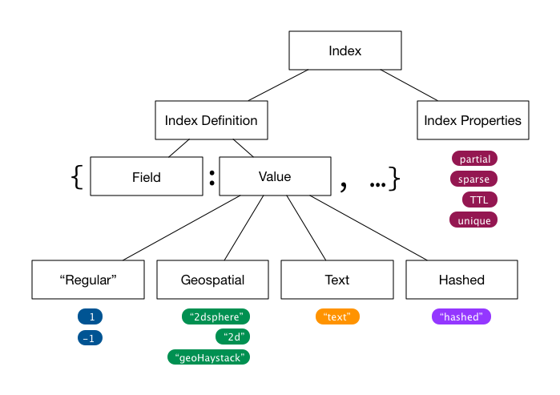

# mongodb-index-model [![][npm_img]][npm_url] [![][travis_img]][travis_url]

MongoDB index model.

## Example

```javascript
var IndexModel = require('mongodb-index-model');

// e.g. from collection.getIndexes()
var indexDefs = [
  {
    'v': 1,
    'key': {
      '_id': 1
    },
    'name': '_id_',
    'ns': 'mongodb.fanclub'
  },
  {
    'v': 1,
    'key': {
      'last_login': -1
    },
    'name': 'last_login_-1',
    'ns': 'mongodb.fanclub'
  }
];

var indexes = new IndexModel(indexDefs, {parse: true});

// get index by `<namespace>.<name>`
indexes.get('mongodb.fanclub.last_login_-1').compound  // returns `false`

// get index by `<name>` (use `name` ampersand index)
indexes.get('_id_', 'name').unique // returns `true`
```

## Installation

```
npm install --save mongodb-index-model
```

## Testing

```
npm test
```

## Index Mental Model

#### General

A _collection_ can have many indexes.
An _index_ can have one or more field/value pairs.
We use JSON notation to represent and index definition as a document of field/value pairs, e.g. `{ last_name: 1, location: "2dsphere" }`.
The _index field_ corresponds to a field in the documents stored in the collection.
The _value_ defines the type, and possibly subtype or sort order of the index on this field.
An index can have additional properties.


#### Index Field Types

Index field types are the following:

- _regular_ (note: the MongoDB Documentation does not mention this type of index explicitly, but rather groups indexes into "single", "compound" and "multi-key". This distinction is not necessary here and would complicate the mental model). The values for regular index fields indicates sort order: `1` for ascending, or `-1` for descending sort order.
- _text_, with the only possible value `text`
- _hashed_, with the only possible value `hashed`
- _geospatial_, where the value specifies the sub-type of geo index, which can be `2d` for a flat, cartesian geometry, `2dsphere` for an index assuming a spherical geometry, or `geoHaystack` for a (rarely used) haystack index.

In summary, given the different types of index and their allowed values, a field value in an index defintion can be one of: `1`, `-1`, `"text"`, `"hashed"`, `"2d"`, `"2dsphere"`, `"geoHaystack"`.


#### Index Properties

An index can have one or more properties. These are independent of the fields and values and defined per index. Index properties are:

- `TTL` "time to live", automatically deletes documents after some time.
- `unique` enforces that no duplicate values exist for this field
- `sparse` means documents without the specified field(s) are not indexed, default is that every document is indexed
- `partial` takes a filter expression and only indexes documents matching that expression. similar to sparse but more flexible.

Index properties are specified as a separate second parameter to the `createIndex()` method. There are limitations which index types and properties can be used together, not every combination is possible.



## License

Apache 2.0

[travis_img]: https://secure.travis-ci.org/mongodb-js/index-model.svg?branch=master
[travis_url]: https://travis-ci.org/mongodb-js/index-model
[npm_img]: https://img.shields.io/npm/v/mongodb-index-model.svg
[npm_url]: https://www.npmjs.org/package/mongodb-index-model
