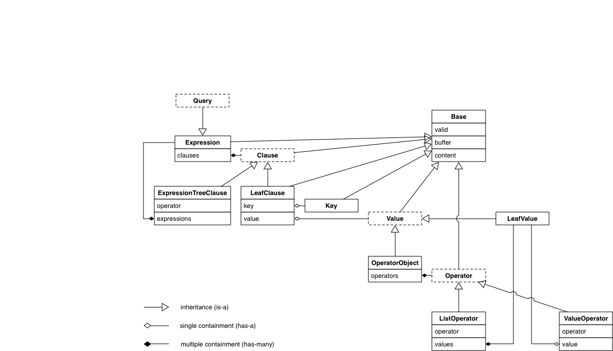

# mongodb-language-model

[](http://travis-ci.org/mongodb-js/mongodb-language-model)

Parses a MongoDB query and creates an abstract syntax tree (AST) with part of speech
tagging. Currently, only [strict extended json][docs-extended-json] syntax is
supported (which means keys have to be surrounded by double quotes and values
have to match the strict syntax of the extended-json format.);

## Usage

The main module exposes two functions: `accepts(queryStr)` and `parse(queryStr)`.

#### `accepts(queryStr)`

The `accepts(queryStr)` function takes a query string and returns `true` if the
string is a valid MongoDB query, `false` otherwise.

Example:

```javascript
var accepts = require('mongodb-language-model').accepts;
var assert = require('assert');

assert.ok(accepts('{"foo": 1}'));
assert.ok(accepts('{"age": {"$gt": 35}}'));
assert.ok(accepts('{"$or": [{"email": {"$exists": true}}, {"phone": {"$exists": true}}]}'));

assert.equal(accepts('{"$invalid": "key"}'), false);
```

#### `parse(queryStr)`

The `parse(queryStr)` function takes a query string and returns an abstract
syntax tree (AST) as a javascript object, if the query is valid. If the
query is not valid, the function throws a `pegjs.SyntaxError` with a message
explaining the failure.

Example:

```javascript
var parse = require('mongodb-language-model').parse;
var assert = require('assert');
var pegjs = require('pegjs');

var ast = parse('{"foo": "bar"}');
assert.deepEqual(ast, {
  'pos': 'expression',
  'clauses': [
    {
      'pos': 'leaf-clause',
      'key': 'foo',
      'value': {
        'pos': 'leaf-value',
        'value': 'bar'
      }
    }
  ]
});
```

## UML diagram

This is the hierarchical model that is created when a query is parsed:




## Installation

```
npm install --save mongodb-language-model
```

## Testing

```
npm test
```

## License

Apache 2.0

[docs-extended-json]: https://docs.mongodb.com/manual/reference/mongodb-extended-json/
